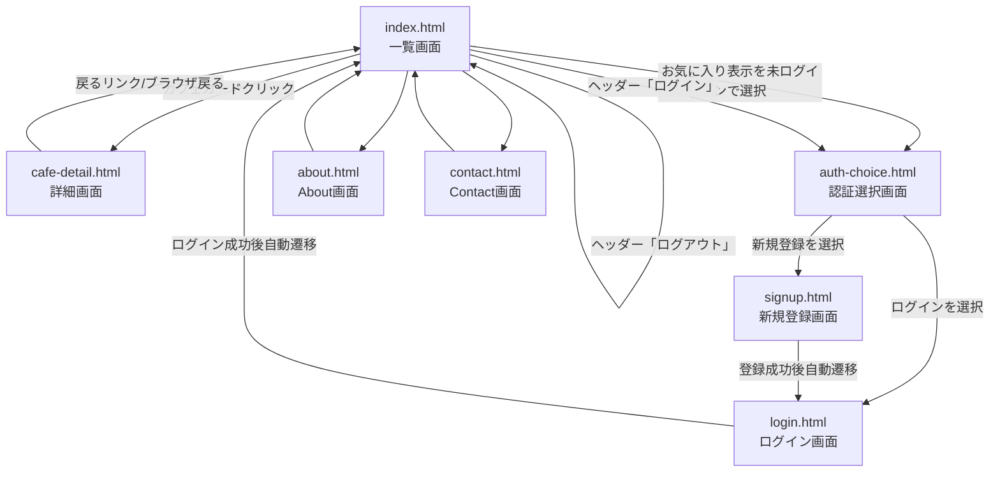

# 制作ドキュメント統合版（05〜10 + ロジック解説）

## 対象
- 05 ワイヤーフレーム
- 06 デザインガイドライン
- 07 仕様書
- 08 DB設計書
- 09 テスト報告書
- 10 振り返り・技術記事
- ロジック解説

---

## 05 ワイヤーフレーム

### 2. トップページ
- ワイヤーフレーム画像: `../images/ChatGPT Image 2026年5月14日 14_19_38.png`
- 設計意図（要約）
  - 上部ナビを固定し主要機能へ即アクセス可能にする
  - 検索UIをファーストビュー中央に配置し主目的を明確化
  - 左側に絞り込み条件、中央〜右にカード一覧で比較性を高める
  - カード上に作業スコア/設備タグ/営業時間を集約し即判断可能にする
  - お気に入り導線をカード右上に置き保存操作を自然化

### 3. 下層ページ
- 画像:
  - `../images/ChatGPT Image 2026年5月14日 14_49_55.png`
  - `../images/ChatGPT Image 2026年5月14日 14_50_07.png`
  - `../images/ChatGPT Image 2026年5月14日 14_50_12.png`
- 意図（要約）
  - 0件時の再検索導線、サービス説明、問い合わせ導線を明確化

### 4. Webアプリ画面
- 画像: `../images/ChatGPT Image 2026年5月14日 16_24_33.png`

### 5. スマートフォン版
- 画像: `../images/ChatGPT Image 2026年5月14日 16_29_27.png`

---

## 06 デザインガイドライン

### 1. デザインコンセプト
- キーワード: 温かみ / シンプル / 使いやすさ
- 方針:
  - 暖色系ベースで落ち着いた作業空間の印象を付与
  - 余白と情報整理で初見でも迷わない導線
  - 検索・絞り込み・カード比較・お気に入り保存を主動線化

### 2. カラーパレット
- 暖色を基調に、可読性と落ち着きを両立する配色運用

### 3. タイポグラフィ
- 見出し/本文/補助情報の階層を分けて情報優先度を明確化

### 4. UIコンポーネント
- ボタン、フォーム、カードの主要スタイルを統一

### 5. レイアウトルール
- 情報優先度に応じて視線誘導を設計
- PC/モバイルでの崩れを抑えたレスポンシブ前提

---

## 07 仕様書

### 1. システム概要
#### システムの目的
本システム「カフェナビ」の目的は、作業・学習向けカフェ探しと再訪管理を効率化することです。コード上では、以下の課題を解決する設計になっています。
- 課題1: 作業しやすいカフェ情報を探しても、後で見返しにくい
  - 価値: 一覧画面でカフェを閲覧し、詳細画面で情報確認できる
- 課題2: 気になったカフェを個人で管理しづらい
  - 価値: 会員登録・ログイン後にお気に入り登録/解除でき、再訪候補を保持できる
- 課題3: ユーザーごとの状態管理がないと、継続利用しにくい
  - 価値: セッション管理（`user_sessions`）により、ログイン状態で個人データ（お気に入り）を扱える

#### システム構成図（テキスト）
```text
[利用者ブラウザ]
  ├─ HTML/CSS/JavaScript
  │   ├─ index.html / main.js（一覧・お気に入り操作）
  │   ├─ login.html / signup.html / auth.js（認証）
  │   └─ cafe-detail.html / cafe-detail.js（詳細表示）
  │
  └─ HTTP(S) API呼び出し
       ↓
[バックエンド: Python server.py]
  ├─ SimpleHTTPRequestHandler + ThreadingHTTPServer
  ├─ API
  │   ├─ POST /api/signup
  │   ├─ POST /api/login
  │   ├─ POST /api/logout
  │   ├─ GET  /api/me
  │   ├─ GET  /api/favorites
  │   ├─ POST /api/favorites
  │   └─ DELETE /api/favorites/{cafeCode}
  └─ 認証/セッション処理・お気に入り管理
       ↓
[データベース: SQLite]
  ├─ users
  ├─ cafes
  ├─ favorites
  └─ user_sessions
```
補足: `config.js` により、ローカル時は同一オリジン、GitHub Pages配信時は Render API（`https://cafe-navi.onrender.com`）を参照。

### 2. 機能一覧（F-001〜F-020）
- Must: 新規登録、ログイン、ログアウト、一覧、ページネーション、詳細、お気に入り追加/解除/一覧、ログイン状態取得、レスポンシブ、エラーメッセージ
- Should: 検索、絞り込み、ソート、地図表示
- Could: CSV出力、カフェ情報編集/削除、ローディング表示

### 3. 画面遷移図（Mermaid記法）


### 4. 機能詳細仕様（要約）
- F-001 新規会員登録: `POST /api/signup`、入力検証、201/400/409
- F-002 ログイン認証: `POST /api/login`、`sessionToken` 発行/保存
- F-003 ログアウト: `POST /api/logout`、セッション破棄
- F-004 一覧表示: カードDOM + お気に入り状態反映
- F-005 ページネーション: 1ページ10件
- F-006 詳細表示: `?id=cafe-x`、地図表示
- F-007/F-008 お気に入り追加/解除: `POST/DELETE /api/favorites`
- F-009 お気に入り一覧: `GET /api/favorites` とカード照合
- F-010 ログイン状態取得: `GET /api/me`

入力項目一覧:
- `userName`, `email`, `password`, `loginEmail`, `loginPassword`, `cafeCode`, `cafeName`, `area`

### 5. 非機能要件
- 認証: メール+パスワード、`user_sessions` 管理
- 認可: お気に入り系はログイン必須、未認証は401
- パスワード: salt + SHA-256
- セッション: 有効期限14日、ログアウトで無効化
- CORS制御、FK/UNIQUE制約で整合性維持
- 対応環境: Chrome/Firefox/Edge/Safari 最新、PC/タブレット/スマホ

---

## 08 DB設計書

### 1. ER図
- 画像: `../images/mermaid-diagram.png`

#### リレーション説明
- `USERS -> FAVORITES`: 1ユーザーは0件以上のお気に入りを持てる
- `CAFES -> FAVORITES`: 1カフェは0件以上のお気に入り登録を持つ
- `USERS -> USER_SESSIONS`: 1ユーザーは0件以上のセッションを持つ

#### 外部キー
- `favorites.user_id -> users.id`
- `favorites.cafe_id -> cafes.id`
- `user_sessions.user_id -> users.id`

補足: `UNIQUE(user_id, cafe_id)` で重複お気に入りを防止。

### 2. テーブル定義（要約）
- `users`: ユーザー情報
- `cafes`: カフェマスタ
- `favorites`: お気に入り関係
- `user_sessions`: セッション情報

### 3. インデックス定義一覧（要約）
- `users.uk_users_email` (UNIQUE)
- `cafes.uk_cafes_external_code` (UNIQUE)
- `favorites.uk_favorites_user_cafe` (UNIQUE)
- `favorites.idx_favorites_user_id` / `idx_favorites_cafe_id`
- `user_sessions.uk_user_sessions_token` (UNIQUE)
- `user_sessions.idx_user_sessions_user_id` / `idx_user_sessions_expires_at`

### 4. 初期データ
```sql
-- Cafe Navi 初期データ（マスタデータ）
USE cafe_navi;

INSERT INTO cafes (external_code, name, area)
VALUES
  ('cafe-1',  'スターバックス渋谷ツタヤ店', '渋谷'),
  ('cafe-2',  'ブルーボトルコーヒー六本木', '六本木'),
  ('cafe-3',  'カフェ・ルミエール池袋', '池袋'),
  ('cafe-4',  'コーヒースタンド神保町', '神保町'),
  ('cafe-5',  'ノマドベース新宿南口', '新宿'),
  ('cafe-6',  'ミドリカフェ秋葉原', '秋葉原'),
  ('cafe-7',  'ワークカフェ品川', '品川'),
  ('cafe-8',  'サニーコーヒー中野', '中野'),
  ('cafe-9',  'ブリーズカフェ恵比寿', '恵比寿'),
  ('cafe-10', 'モーニングロースト目黒', '目黒'),
  ('cafe-11', 'クラフトビーンズ吉祥寺', '吉祥寺')
ON DUPLICATE KEY UPDATE
  name = VALUES(name),
  area = VALUES(area);
```

---

## 09 テスト報告書

### 1. テスト計画
- 単体: `main.js / auth.js` の入力処理・表示切替・ページネーション
- API/結合: `server.py` と SQLite（セッション・お気に入り）
- 画面: 登録→ログイン→一覧→詳細→お気に入り→ログアウト
- 回帰: 認証機能変更時の導線破壊チェック

### 2. テストケース一覧
- `TC-001`〜`TC-020` を実施、全件 `OK`
- 対象: 新規登録、ログイン、セッション確認、一覧、ページング、詳細、
  お気に入り追加/解除/一覧、ログアウト、DB整合性

### 3. テスト結果サマリー
- 総テストケース数: 20
- OK: 20
- NG: 0
- 未実施: 0
- 合格率: 100%

### 4. バグ一覧
- `BUG-001`: bcrypt記述と実装差異（低 / 修正済）
- `BUG-002`: token保持方式二重化（低 / 保留）
- `BUG-003`: 詳細画面データが静的（中 / 対応中）

### 5. ブラウザ・デバイス対応
- Chrome/Firefox/Edge(PC): 表示○ 機能○
- Chrome(Android): 表示○ 機能○
- Safari(iPhone): 表示○ 機能△（Cookie/Storage挙動差異を追加確認推奨）

---

## 10 振り返り・技術記事

### 1. プロジェクト振り返り
- フロントエンド実装の振り返り: API連携・状態切替を実装、詳細静的データや検索系未実装が課題
- バックエンド実装の振り返り: レイヤー構成実践、検証/例外/認可/テスト強化が課題
- 全体の学び: 要件→設計→実装→テスト→改善を通した開発力の重要性

### 2. 技術記事
- タイトル: 「Python（標準ライブラリ）とSQLiteで実装するカフェナビの認証・お気に入り機能」
- 本文: 認証、セッション、お気に入りAPI、fetch連携、テスト結果、改善計画を記載

### 3. スキル自己評価
- HTML/CSS: ★★★★☆
- JavaScript: ★★★★☆
- Java: ★★★☆☆
- Spring Boot: ★★★☆☆
- データベース: ★★★★☆
- UI/UXデザイン: ★★★☆☆
- Figma: ★★★☆☆
- Git/GitHub: ★★★☆☆
- AI活用（プロンプト）: ★★★★☆
- マーケティング: ★★☆☆☆

### 4. 今後の学習計画
1. バックエンド実践力強化
2. DB/性能改善
3. フロントエンド高度化
4. インフラ/運用スキル
5. プロダクト思考強化

最終目標: フロント〜バックエンド〜DB〜運用まで一貫して改善できる **Webエンジニア**。

---

## ロジック解説

### 1. ログイン処理のロジック
- フロー: `login.html` 送信 → `/api/login` → `users` 検索 → `verify_password`
- 成功時: `sessionToken` 発行・保存、`index.html` へ遷移
- 失敗時: 401または通信エラー表示

### 2. バリデーション処理のロジック
- `POST /todo/confirm` で手動必須チェック（title）
- エラー時は入力画面再表示、正常時は確認画面
- `POST /todo/complete` で再確認後DB登録
- Thymeleaf例: `th:if` + `th:text` で安全表示

### 3. 検索処理のロジック
- `keyword/completed/fromDate/toDate` の有無でWHERE句を動的組立
- 条件をAND連結し `ORDER BY id DESC`

### 4. 権限チェックのロジック
- `Authorization/Cookie` からtoken取得
- `user_sessions` と `expires_at` を照合
- 未認証は401、対象データ不存在は404、他人データは403
- SQLレベル制御: `WHERE id=:taskId AND user_id=:loginUserId`

### 5. ステータス遷移のロジック
- 現行は2状態のみ: `completed=false` ⇄ `completed=true`
- toggle方式で存在タスクは切替可、保存成功で反映

---

## 備考
- 本ファイルは各HTML資料の入力済み内容を、提出・レビューしやすいように統合したMarkdown版です。
